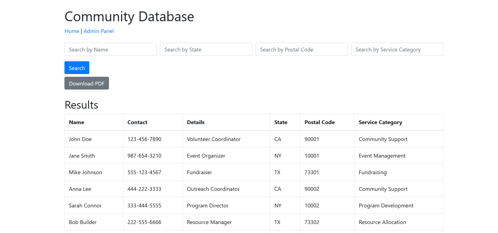

# Community Database Application



This is a simple Flask web application that allows users to search and view community database records stored in an Excel file. The application also provides functionality to download the filtered results as a PDF.

## Features

- Search records by Name, State, Postal Code, and Service Category.
- View results in a tabular format.
- Download search results as a PDF file.

## Technologies Used

- **Flask**: A micro web framework for Python.
- **Pandas**: A powerful data manipulation and analysis library.
- **FPDF**: A library to create PDF documents in Python.
- **Bootstrap**: A front-end framework for developing responsive web applications.

## Requirements

To run this application, ensure you have the following installed:

- Python 3.x
- pip (Python package installer)

### Python Packages

You can install the required packages using pip. Create a virtual environment (recommended) and run:

```bash
pip install flask pandas fpdf openpyxl
```

## Getting Started

### 1. Clone the repository:

```
git clone https://github.com/yourusername/community-database-app.git
cd community-database-app
```

### 2. Add your Excel database file:

Place your database.xlsx file in the root directory of the project.

### 3. Run the application:

```
python app.py
```

The application will start, and you can access it at http://127.0.0.1:5000/ in your web browser.

## Usage

Use the search form on the homepage to filter records.
Click the "Download PDF" button to export the current results.

## Project Structure

```
community-database-app/
├── app.py                # Main application file
├── database.xlsx         # Excel file containing the community database
├── templates/
│   ├── index.html       # Template for the index page
│   └── admin.html       # Template for the admin page (optional)
└── README.md             # This README file
```

## License

This project is licensed under the MIT License. See the LICENSE file for details.

## Acknowledgments

    Flask - The web framework used.
    Pandas - For data manipulation.
    FPDF - For generating PDF documents.


## Contributing

Contributions are welcome! Please open an issue or submit a pull request for any enhancements or bug fixes.

## Contact

if you have any question or would like to build a similar project please reach out to us at info@avionanalytics.com

